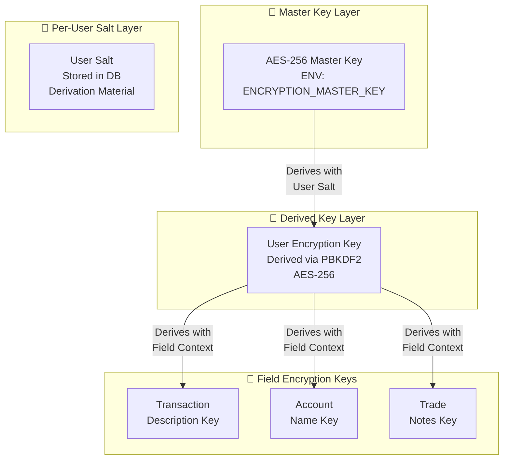
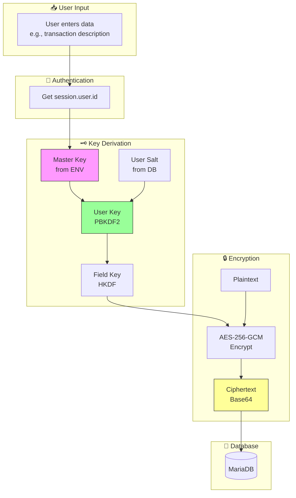
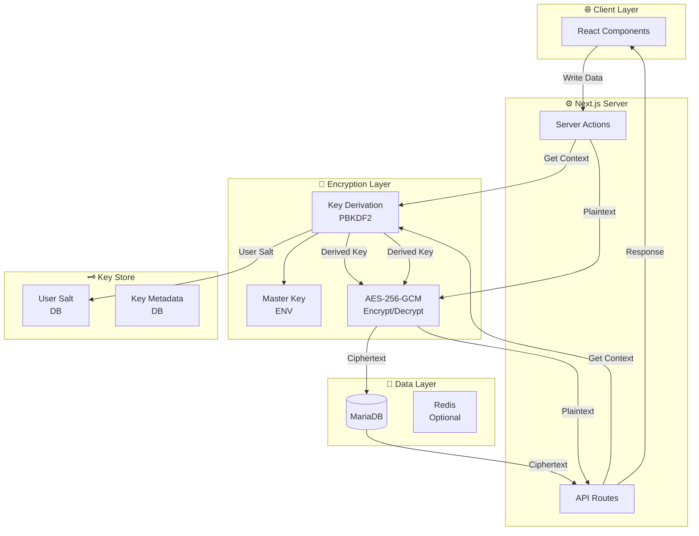

# FinHealth Encryption Architecture Specification

**Version:** 1.0  
**Created:** 2026-03-02  
**Status:** Draft for Review

---

## 1. Executive Summary

This document outlines a comprehensive field-level encryption architecture for the FinHealth expense tracker application. The solution implements AES-256-GCM encryption with per-user key derivation, ensuring data isolation while maintaining self-hosted key management without external KMS dependencies.

### 1.1 Design Goals

| Goal | Description |
|------|-------------|
| **Data Isolation** | Each user has their own derived encryption key |
| **Self-Hosted** | No external KMS services required |
| **Field-Level** | Encrypt sensitive fields at the column level |
| **Audit Ready** | Support key rotation without data migration |
| **Performance** | Minimize encryption overhead on read/write operations |

---

## 2. Key Hierarchy Design

### 2.1 Hierarchy Overview



### 2.2 Key Components

#### 2.2.1 Master Key (Layer 1)

- **Storage:** Environment variable `ENCRYPTION_MASTER_KEY`
- **Format:** Base64-encoded 256-bit key (43 characters)
- **Generation:** `openssl rand -base64 32`
- **Protection:** File system permissions (400), not committed to VCS

```bash
# Generate master key
openssl rand -base64 32 > .encryption-key
chmod 400 .encryption-key
```

#### 2.2.2 User Salt (Layer 2)

- **Storage:** Database `User` table
- **Format:** 32-byte random binary, stored as Base64
- **Purpose:** Prevents rainbow table attacks, ensures per-user key isolation
- **Generation:** CSPRNG on user registration

#### 2.2.3 User Encryption Key (Layer 3)

- **Derivation:** PBKDF2-SHA512
- **Parameters:**
  - Iterations: 100,000
  - Salt: User's unique salt from database
  - Key length: 256 bits
- **Output:** Per-user encryption key

```typescript
// Derivation formula
derivedKey = PBKDF2(
  password: masterKey,  // From ENV
  salt: userSalt,       // From DB
  iterations: 100000,
  keyLength: 32 bytes,
  algorithm: SHA-512
)
```

#### 2.2.4 Per-Field Keys (Optional - Layer 4)

For enhanced security, individual fields can use context-specific sub-keys:

```typescript
// Field key derivation
fieldKey = HKDF-SHA256(
  ikm: userEncryptionKey,
  salt: fieldName,  // e.g., "transaction.description"
  info: "field-encryption",
  length: 32 bytes
)
```

---

## 3. Data Classification Matrix

### 3.1 Classification Levels

| Level | Description | Examples |
|-------|-------------|----------|
| **Critical** | PII, security-related | Passwords (hashed), IP addresses, user agents |
| **High** | Financial details, identifiers | Transaction descriptions, reference numbers, notes |
| **Medium** | User-created content | Account names, account descriptions, trade notes |
| **Low** | Numeric values | Amounts, balances (protected by user isolation) |

### 3.2 Field Classification by Model

#### User Model

| Field | Classification | Current State | Encrypted |
|-------|----------------|---------------|-----------|
| `id` | Low | UUID | No |
| `name` | Medium | Plain text | **Recommended** |
| `email` | Critical | Plain text | No (required for auth) |
| `password` | Critical | bcrypt hash | No (already hashed) |
| `mainCurrency` | Low | Plain text | No |

#### FinancialAccount Model

| Field | Classification | Current State | Encrypted |
|-------|----------------|---------------|-----------|
| `id` | Low | UUID | No |
| `name` | Medium | Plain text | **Required** |
| `type` | Low | Enum | No |
| `currency` | Low | Plain text | No |
| `balance` | Low | Float | No |
| `description` | High | Plain text | **Required** |
| `isActive` | Low | Boolean | No |

#### Transaction Model

| Field | Classification | Current State | Encrypted |
|-------|----------------|---------------|-----------|
| `id` | Low | UUID | No |
| `amount` | Low | Float | No |
| `currency` | Low | Plain text | No |
| `exchangeRate` | Low | Float | No |
| `type` | Low | Enum | No |
| `description` | High | Plain text | **Required** |
| `date` | Low | DateTime | No |
| `referenceNumber` | High | Plain text | **Required** |
| `createdBy` | Medium | String | No |

#### TradeHistory Model

| Field | Classification | Current State | Encrypted |
|-------|----------------|---------------|-----------|
| `id` | Low | UUID | No |
| `type` | Low | Enum | No |
| `quantity` | Low | Float | No |
| `pricePerUnit` | Low | Float | No |
| `totalAmount` | Low | Float | No |
| `fees` | Low | Float | No |
| `date` | Low | DateTime | No |
| `notes` | High | Plain text | **Required** |
| `realizedPnL` | Low | Float | No |

#### RecurringRule Model

| Field | Classification | Current State | Encrypted |
|-------|----------------|---------------|-----------|
| `id` | Low | UUID | No |
| `name` | Medium | Plain text | **Recommended** |
| `amount` | Low | Float | No |
| `currency` | Low | Plain text | No |
| `type` | Low | Enum | No |
| `interval` | Low | Enum | No |
| `nextDueDate` | Low | DateTime | No |
| `endDate` | Low | DateTime | No |
| `description` | High | Plain text | **Required** |

#### LiabilityPaymentAudit Model

| Field | Classification | Current State | Encrypted |
|-------|----------------|---------------|-----------|
| `ipAddress` | Critical | Plain text | **Required** |
| `userAgent` | Critical | Plain text | **Required** |
| Other fields | Low | Various | No |

#### SavingsGoal Model

| Field | Classification | Current State | Encrypted |
|-------|----------------|---------------|-----------|
| `name` | Medium | Plain text | **Recommended** |
| `description` | High | Plain text | **Required** |
| `icon` | Low | String | No |
| `color` | Low | String | No |
| Other fields | Low | Various | No |

---

## 4. Prisma Schema Design

### 4.1 Option B: New Encrypted Field Columns (Recommended)

This approach adds new columns alongside existing plaintext columns, allowing gradual migration.

#### 4.1.1 Modified Schema

```prisma
// prisma/schema.prisma additions

model User {
  id            String    @id @default(cuid())
  name          String?
  nameEncrypted String?   @db.Text  // Encrypted name
  email         String    @unique
  // ... existing fields
  
  // Encryption metadata
  encryptionSalt     String?  @db.Text  // Base64-encoded salt
  encryptionVersion  Int      @default(1) // For key rotation
  encryptedKeyIv     String?  // IV for encrypted per-user key backup
  
  createdAt DateTime @default(now())
  updatedAt DateTime @updatedAt
  
  // Relations
  accounts       FinancialAccount[]
  transactions   Transaction[]
  // ... other relations
}

// Extend FinancialAccount
model FinancialAccount {
  id          String      @id @default(cuid())
  name        String
  nameEncrypted String?   @db.Text  // Encrypted account name
  type        AccountType
  currency    String      @default("IDR")
  balance     Float       @default(0)
  description String?
  descriptionEncrypted String? @db.Text  // Encrypted description
  isActive    Boolean     @default(true)
  
  // Encryption metadata
  lastEncryptedAt DateTime?
  
  userId String
  user   User   @relation(fields: [userId], references: [id], onDelete: Cascade)
  
  // ... existing relations
  
  @@index([userId])
}

// Extend Transaction  
model Transaction {
  id           String          @id @default(cuid())
  amount       Float
  currency     String          @default("IDR")
  exchangeRate Float           @default(1)
  type         TransactionType
  description  String?
  descriptionEncrypted String?  @db.Text  // Encrypted description
  date         DateTime        @default(now())
  // ... existing fields
  
  // Encrypted fields
  referenceNumber         String?
  referenceNumberEncrypted String? @db.Text
  createdByEncrypted       String? @db.Text
  
  @@index([userId])
  @@index([accountId])
  @@index([date])
}

// Extend TradeHistory
model TradeHistory {
  id           String    @id @default(cuid())
  type         TradeType
  quantity     Float
  pricePerUnit Float
  totalAmount  Float
  fees         Float     @default(0)
  date         DateTime  @default(now())
  notes        String?
  notesEncrypted String? @db.Text  // Encrypted notes
  // ... existing fields
  
  @@index([userId])
  @@index([assetId])
}

// Extend RecurringRule
model RecurringRule {
  id          String            @id @default(cuid())
  name        String
  nameEncrypted String?         @db.Text
  amount      Float
  currency    String            @default("IDR")
  type        TransactionType
  interval    RecurringInterval
  nextDueDate DateTime
  endDate     DateTime?
  isActive    Boolean           @default(true)
  
  // Template data (encrypted)
  description String?
  descriptionEncrypted String? @db.Text
  
  // ... existing relations
}

// Extend LiabilityPaymentAudit
model LiabilityPaymentAudit {
  id            String      @id @default(cuid())
  transactionId String      @unique
  // ... existing fields
  
  // Encrypted security fields
  ipAddress     String?
  ipAddressEncrypted String? @db.Text
  
  userAgent     String?
  userAgentEncrypted String? @db.Text
  
  @@index([transactionId])
  @@index([executedBy])
}
```

### 4.2 Encryption Metadata Model

```prisma
// Track encryption key versions for rotation
model EncryptionKeyVersion {
  id              String   @id @default(cuid())
  userId          String   @unique
  keyVersion      Int      @default(1)
  encryptedBackup String?  @db.Text  // Per-user key encrypted with new master key
  rotatedAt       DateTime @default(now())
  createdAt       DateTime @default(now())
  
  @@index([userId])
}
```

---

## 5. Encryption Implementation

### 5.1 Core Encryption Module

Create `src/lib/encryption.ts`:

```typescript
import { createCipheriv, createDecipheriv, randomBytes, pbkdf2Sync, createHash } from "crypto";
import { Buffer } from "buffer";

const ALGORITHM = "aes-256-gcm";
const KEY_LENGTH = 32; // 256 bits
const IV_LENGTH = 16; // 128 bits
const AUTH_TAG_LENGTH = 16;
const SALT_LENGTH = 32;
const PBKDF2_ITERATIONS = 100000;
const PBKDF2_DIGEST = "sha512";

/**
 * Get master key from environment variable
 */
export function getMasterKey(): Buffer {
  const key = process.env.ENCRYPTION_MASTER_KEY;
  if (!key) {
    throw new Error("ENCRYPTION_MASTER_KEY environment variable is not set");
  }
  return Buffer.from(key, "base64");
}

/**
 * Generate cryptographically secure random bytes
 */
export function generateRandomBytes(length: number): Buffer {
  return randomBytes(length);
}

/**
 * Generate a new user salt
 */
export function generateUserSalt(): string {
  return generateRandomBytes(SALT_LENGTH).toString("base64");
}

/**
 * Derive user encryption key from master key and user salt using PBKDF2
 */
export function deriveUserKey(masterKey: Buffer, userSalt: string): Buffer {
  const salt = Buffer.from(userSalt, "base64");
  return pbkdf2Sync(
    masterKey,
    salt,
    PBKDF2_ITERATIONS,
    KEY_LENGTH,
    PBKDF2_DIGEST
  );
}

/**
 * Derive field-specific key using HKDF-like construction
 */
export function deriveFieldKey(userKey: Buffer, fieldName: string): Buffer {
  const info = createHash("sha256").update(fieldName).digest();
  const combined = Buffer.concat([userKey, info]);
  return createHash("sha256").update(combined).digest();
}

/**
 * Encrypt plaintext using AES-256-GCM
 * Returns: { iv: string, authTag: string, ciphertext: string } as base64
 */
export function encrypt(plaintext: string, key: Buffer): string {
  const iv = randomBytes(IV_LENGTH);
  const cipher = createCipheriv(ALGORITHM, key, iv, {
    authTagLength: AUTH_TAG_LENGTH,
  });

  const encrypted = Buffer.concat([
    cipher.update(plaintext, "utf8"),
    cipher.final(),
  ]);
  
  const authTag = cipher.getAuthTag();

  // Combine: IV + AuthTag + Ciphertext
  const combined = Buffer.concat([iv, authTag, encrypted]);
  return combined.toString("base64");
}

/**
 * Decrypt ciphertext using AES-256-GCM
 */
export function decrypt(ciphertext: string, key: Buffer): string {
  const combined = Buffer.from(ciphertext, "base64");
  
  const iv = combined.subarray(0, IV_LENGTH);
  const authTag = combined.subarray(IV_LENGTH, IV_LENGTH + AUTH_TAG_LENGTH);
  const encrypted = combined.subarray(IV_LENGTH + AUTH_TAG_LENGTH);

  const decipher = createDecipheriv(ALGORITHM, key, iv, {
    authTagLength: AUTH_TAG_LENGTH,
  });
  
  decipher.setAuthTag(authTag);

  const decrypted = Buffer.concat([
    decipher.update(encrypted),
    decipher.final(),
  ]);
  
  return decrypted.toString("utf8");
}

/**
 * Encrypt an object's specified fields
 */
export function encryptFields<T extends Record<string, unknown>>(
  data: T,
  fields: string[],
  key: Buffer
): T {
  const result = { ...data };
  
  for (const field of fields) {
    const value = result[field];
    if (typeof value === "string" && value.length > 0) {
      result[`${field}Encrypted`] = encrypt(value, key) as T[Extract<keyof T, string>];
    }
  }
  
  return result;
}

/**
 * Decrypt an object's specified encrypted fields
 */
export function decryptFields<T extends Record<string, unknown>>(
  data: T,
  fields: string[],
  key: Buffer
): T {
  const result = { ...data };
  
  for (const field of fields) {
    const encryptedField = `${field}Encrypted` as keyof T;
    const encryptedValue = data[encryptedField];
    
    if (typeof encryptedValue === "string" && encryptedValue.length > 0) {
      result[field] = decrypt(encryptedValue, key) as T[Extract<keyof T, string>];
    }
  }
  
  return result;
}
```

### 5.2 Key Management Module

Create `src/lib/key-management.ts`:

```typescript
import { getMasterKey, generateUserSalt, deriveUserKey, deriveFieldKey } from "./encryption";
import prisma from "@/lib/db";
import { auth } from "@/auth";

export interface UserKeyContext {
  userId: string;
  encryptionKey: Buffer;
  salt: string;
  version: number;
}

/**
 * Get or create encryption context for a user
 */
export async function getUserKeyContext(userId: string): Promise<UserKeyContext> {
  const masterKey = getMasterKey();
  
  // Get or create user salt
  let user = await prisma.user.findUnique({
    where: { id: userId },
    select: { encryptionSalt: true, encryptionVersion: true },
  });

  if (!user) {
    throw new Error("User not found");
  }

  // Create salt if doesn't exist (for existing users)
  let salt = user.encryptionSalt;
  if (!salt) {
    salt = generateUserSalt();
    await prisma.user.update({
      where: { id: userId },
      data: { encryptionSalt: salt },
    });
  }

  const encryptionKey = deriveUserKey(masterKey, salt);
  const version = user.encryptionVersion || 1;

  return {
    userId,
    encryptionKey,
    salt,
    version,
  };
}

/**
 * Get field-specific encryption key
 */
export function getFieldKey(userKeyContext: UserKeyContext, fieldName: string): Buffer {
  return deriveFieldKey(userKeyContext.encryptionKey, fieldName);
}

/**
 * Rotate user encryption key (for key rotation)
 */
export async function rotateUserKey(userId: string, newMasterKey?: Buffer): Promise<void> {
  const masterKey = newMasterKey || getMasterKey();
  
  // Generate new salt
  const newSalt = generateUserSalt();
  
  // Update user with new salt and increment version
  await prisma.user.update({
    where: { id: userId },
    data: {
      encryptionSalt: newSalt,
      encryptionVersion: { increment: 1 },
    },
  });
  
  // Note: In production, you'd need to re-encrypt all user data here
  // This is handled by a background job
}

/**
 * Export user key (encrypted with provided password) for backup
 */
export async function exportUserKey(userId: string, password: string): Promise<string> {
  const { encryptionKey, salt, version } = await getUserKeyContext(userId);
  
  // Derive key from password for backup encryption
  const backupKey = pbkdf2Sync(password, salt, 100000, 32, "sha512");
  
  // Encrypt the user's encryption key
  const encryptedKey = encrypt(encryptionKey.toString("base64"), backupKey);
  
  return JSON.stringify({
    userId,
    version,
    salt,
    encryptedKey,
  });
}

/**
 * Import user key from backup
 */
export async function importUserKey(backupData: string, password: string): Promise<void> {
  const { userId, salt, encryptedKey } = JSON.parse(backupData);
  
  // Derive backup key
  const backupKey = pbkdf2Sync(password, salt, 100000, 32, "sha512");
  
  // Decrypt user's key
  const userKeyBase64 = decrypt(encryptedKey, backupKey);
  const userKey = Buffer.from(userKeyBase64, "base64");
  
  // Note: This would need to re-encrypt data with new master key if different
  console.log("Imported key for user:", userId);
}
```

### 5.3 Type Definitions

Create `src/types/encryption.ts`:

```typescript
export interface EncryptedField {
  encrypted: string;
  iv?: string;
}

export interface EncryptionConfig {
  masterKey: string;
  algorithm: "aes-256-gcm";
  pbkdf2Iterations: number;
  saltLength: number;
  ivLength: number;
}

export interface UserEncryptionMetadata {
  userId: string;
  salt: string;
  version: number;
  rotatedAt?: Date;
}

export type EncryptedFields<T> = {
  [K in keyof T as `${string & K}Encrypted`]?: string;
};

export interface EncryptionResult {
  success: boolean;
  data?: string;
  error?: string;
}
```

---

## 6. Encryption/Decryption Flow

### 6.1 Write Path (Create/Update)



### 6.2 Read Path

```mermaid
flowchart TD
    subgraph DB["💾 Database"]
        DB[(MariaDB)]
    end
    
    subgraph Key["🗝️ Key Derivation"]
        MK["Master Key<br/>from ENV"]
        US["User Salt<br/>from DB"]
        UK["User Key<br/>PBKDF2"]
        FK["Field Key<br/>HKDF"]
    end
    
    subgraph Decrypt["🔓 Decryption"]
        CT["Ciphertext<br/>Base64"]
        AD["AES-256-GCM<br/>Decrypt"]
        PT["Plaintext"]
    end
    
    subgraph Output["📤 Response"]
        RESP["Return data<br/>with decrypted fields"]
    end
    
    DB --> CT
    CT --> AD
    MK --> UK
    US --> UK
    UK --> FK
    FK --> AD
    AD --> PT
    PT --> RESP
    
    style MK fill:#f9f,stroke:#333
    style UK fill:#9f9,stroke:#333
    style PT fill:#9ff,stroke:#333
```

### 6.3 Code Implementation Examples

#### 6.3.1 Encrypting on Create

```typescript
// src/actions/transaction-actions.ts

import { getUserKeyContext, getFieldKey } from "@/lib/key-management";
import { encrypt } from "@/lib/encryption";

export async function createTransaction(data: TransactionInput) {
  // ... existing auth check
  
  const userKeyContext = await getUserKeyContext(session.user.id);
  const fieldKey = getFieldKey(userKeyContext, "transaction.description");
  
  const encryptedData = {
    ...data,
    descriptionEncrypted: data.description 
      ? encrypt(data.description, fieldKey)
      : null,
  };
  
  // Store both for backward compatibility during migration
  const transaction = await prisma.transaction.create({
    data: {
      ...data,
      description: data.description, // Keep plaintext during migration
      descriptionEncrypted: encryptedData.descriptionEncrypted,
    },
  });
  
  revalidatePath("/dashboard/transactions");
  return { success: true, data: transaction };
}
```

#### 6.3.2 Decrypting on Read

```typescript
// src/actions/transaction-actions.ts

import { getUserKeyContext, getFieldKey } from "@/lib/key-management";
import { decrypt } from "@/lib/encryption";

export async function getTransactions(filters?: TransactionFilters) {
  // ... existing auth check
  
  const userKeyContext = await getUserKeyContext(session.user.id);
  const fieldKey = getFieldKey(userKeyContext, "transaction.description");
  
  const transactions = await prisma.transaction.findMany({
    where: { userId: session.user.id, ...filters },
    include: { category: true, account: true },
    orderBy: { date: "desc" },
  });
  
  // Decrypt sensitive fields
  const decryptedTransactions = transactions.map((t) => ({
    ...t,
    description: t.descriptionEncrypted
      ? decrypt(t.descriptionEncrypted, fieldKey)
      : t.description,
    referenceNumber: t.referenceNumberEncrypted
      ? decrypt(t.referenceNumberEncrypted, fieldKey)
      : t.referenceNumber,
  }));
  
  return { success: true, data: decryptedTransactions };
}
```

---

## 7. Key Management Features

### 7.1 Key Generation

```typescript
// src/lib/key-generation.ts

import { randomBytes } from "crypto";

export interface GeneratedKeyMaterial {
  masterKey: string;
  salt: string;
}

/**
 * Generate new master key
 */
export function generateMasterKey(): string {
  return randomBytes(32).toString("base64");
}

/**
 * Generate user salt
 */
export function generateUserSalt(): string {
  return randomBytes(32).toString("base64");
}

/**
 * Generate initial encryption setup for new user
 */
export async function initializeUserEncryption(userId: string): Promise<void> {
  const salt = generateUserSalt();
  
  await prisma.user.update({
    where: { id: userId },
    data: {
      encryptionSalt: salt,
      encryptionVersion: 1,
    },
  });
}
```

### 7.2 Key Rotation Support

```typescript
// src/lib/key-rotation.ts

import { getMasterKey, deriveUserKey, encrypt, decrypt } from "./encryption";
import prisma from "@/lib/db";

export interface KeyRotationProgress {
  userId: string;
  totalRecords: number;
  processedRecords: number;
  status: "pending" | "in_progress" | "completed" | "failed";
}

/**
 * Rotate all encrypted data for a user
 */
export async function rotateUserEncryption(
  userId: string,
  onProgress?: (progress: KeyRotationProgress) => void
): Promise<void> {
  const oldMasterKey = getMasterKey();
  
  // Get user salt (current)
  const user = await prisma.user.findUnique({
    where: { id: userId },
    select: { encryptionSalt: true, encryptionVersion: true },
  });
  
  if (!user?.encryptionSalt) {
    throw new Error("User encryption not initialized");
  }
  
  // Derive old key
  const oldKey = deriveUserKey(oldMasterKey, user.encryptionSalt);
  
  // Generate new salt
  const newSalt = randomBytes(32).toString("base64");
  const newKey = deriveUserKey(oldMasterKey, newSalt);
  
  // Re-encrypt all data (batch processing for large datasets)
  await reencryptTable(prisma.transaction, userId, oldKey, newKey, [
    "description",
    "referenceNumber",
  ]);
  
  await reencryptTable(prisma.financialAccount, userId, oldKey, newKey, [
    "name",
    "description",
  ]);
  
  await reencryptTable(prisma.tradeHistory, userId, oldKey, newKey, ["notes"]);
  
  // Update user salt and version
  await prisma.user.update({
    where: { id: userId },
    data: {
      encryptionSalt: newSalt,
      encryptionVersion: { increment: 1 },
    },
  });
}

async function reencryptTable(
  model: any,
  userId: string,
  oldKey: Buffer,
  newKey: Buffer,
  fields: string[]
): Promise<void> {
  // Process in batches
  const batchSize = 100;
  let offset = 0;
  
  while (true) {
    const records = await model.findMany({
      where: { userId },
      skip: offset,
      take: batchSize,
    });
    
    if (records.length === 0) break;
    
    for (const record of records) {
      const updates: any = {};
      
      for (const field of fields) {
        const encryptedField = `${field}Encrypted`;
        if (record[encryptedField]) {
          try {
            const decrypted = decrypt(record[encryptedField], oldKey);
            updates[encryptedField] = encrypt(decrypted, newKey);
          } catch (e) {
            console.error(`Failed to reencrypt ${field} for record ${record.id}`);
          }
        }
      }
      
      if (Object.keys(updates).length > 0) {
        await model.update({
          where: { id: record.id },
          data: updates,
        });
      }
    }
    
    offset += batchSize;
  }
}
```

### 7.3 Key Backup/Recovery

```typescript
// src/lib/key-backup.ts

import { randomBytes, pbkdf2Sync, createCipheriv, createDecipheriv } from "crypto";
import prisma from "@/lib/db";

interface KeyBackup {
  userId: string;
  encryptedKey: string;
  salt: string;
  iv: string;
  createdAt: Date;
}

/**
 * Create encrypted backup of user encryption key
 */
export async function createKeyBackup(
  userId: string,
  password: string
): Promise<KeyBackup> {
  const user = await prisma.user.findUnique({
    where: { id: userId },
    select: { encryptionSalt: true },
  });
  
  if (!user?.encryptionSalt) {
    throw new Error("User encryption not initialized");
  }
  
  const masterKey = getMasterKey();
  const userKey = deriveUserKey(masterKey, user.encryptionSalt);
  
  // Derive encryption key from user's password
  const salt = randomBytes(32);
  const backupKey = pbkdf2Sync(password, salt, 100000, 32, "sha512");
  
  // Encrypt user key
  const iv = randomBytes(16);
  const cipher = createCipheriv("aes-256-gcm", backupKey, iv);
  
  const encryptedKey = Buffer.concat([
    cipher.update(userKey.toString("base64")),
    cipher.final(),
  ]);
  const authTag = cipher.getAuthTag();
  
  return {
    userId,
    encryptedKey: Buffer.concat([encryptedKey, authTag]).toString("base64"),
    salt: salt.toString("base64"),
    iv: iv.toString("base64"),
    createdAt: new Date(),
  };
}

/**
 * Restore user encryption key from backup
 */
export async function restoreKeyBackup(
  backup: KeyBackup,
  password: string
): Promise<void> {
  const salt = Buffer.from(backup.salt, "base64");
  const iv = Buffer.from(backup.iv, "base64");
  const encryptedKey = Buffer.from(backup.encryptedKey, "base64");
  
  // Derive backup key from password
  const backupKey = pbkdf2Sync(password, salt, 100000, 32, "sha512");
  
  // Decrypt user key
  const encrypted = encryptedKey.subarray(0, -16);
  const authTag = encryptedKey.subarray(-16);
  
  const decipher = createDecipheriv("aes-256-gcm", backupKey, iv);
  decipher.setAuthTag(authTag);
  
  const decrypted = Buffer.concat([
    decipher.update(encrypted),
    decipher.final(),
  ]).toString("base64");
  
  // Verify the restored key works (would need to test encryption/decryption)
  console.log("Restored key for user:", backup.userId, "Key length:", decrypted.length);
}
```

---

## 8. Environment Configuration

### 8.1 Required Environment Variables

```bash
# .env

# Existing variables
DATABASE_URL="mariadb://root@localhost:3306/expense_tracker"
AUTH_SECRET="ViRwlAV0lRrEbM+5xIOV/By2d0WZnbWZq81Vu3rwH1g="
AUTH_URL="http://localhost:3000"
CRON_SECRET="cron-secret-$(openssl rand -hex 16)"

# NEW: Encryption Master Key (REQUIRED)
# Generate with: openssl rand -base64 32
ENCRYPTION_MASTER_KEY="<43-character-base64-string>"

# Optional: Key rotation settings
ENCRYPTION_KEY_ROTATION_DAYS=90
ENCRYPTION_BACKUP_ENABLED=true
```

### 8.2 Generating Master Key

```bash
# Generate a new master key
openssl rand -base64 32

# Example output (copy to .env):
# aB3cD4eF5gH6iJ7kL8mN9oP0qR1sT2uV3wX4yZ5A6bC7dE8fG9hI0jK1lM2nO
```

---

## 9. Migration Strategy

### 9.1 Phase 1: Schema Migration

1. Add new encrypted columns to existing tables
2. Add encryption metadata columns to User table
3. Run migration: `pnpm prisma migrate dev --name add_encryption_columns`

### 9.2 Phase 2: Initialize Encryption

1. Generate salt for all existing users
2. Back up database before re-encryption
3. Run batch encryption for all sensitive fields

### 9.3 Phase 3: Enable Encryption in Application

1. Update server actions to encrypt on write
2. Update query hooks to decrypt on read
3. Remove plaintext fallback after verification

### 9.4 Phase 4: Decommission

1. Drop plaintext columns after full verification
2. Archive backup of pre-encryption database
3. Document encryption configuration

---

## 10. Security Considerations

### 10.1 Threat Model

| Threat | Mitigation |
|--------|------------|
| Database breach | AES-256-GCM encryption |
| Backup theft | Per-user key derivation |
| Rainbow tables | Unique per-user salt |
| Key compromise | Key rotation support |
| Brute force | 100,000 PBKDF2 iterations |

### 10.2 Security Checklist

- [ ] Master key stored in environment variable only
- [ ] Master key not committed to version control
- [ ] File permissions restrict key file access (400)
- [ ] HTTPS enforced in production
- [ ] Key rotation implemented
- [ ] Backup encryption with user password
- [ ] Audit logging for key operations
- [ ] No sensitive data in logs

---

## 11. Implementation TODO List

```
[ ] Add ENCRYPTION_MASTER_KEY to .env
[ ] Update Prisma schema with encrypted fields
[ ] Create src/lib/encryption.ts - Core crypto functions
[ ] Create src/lib/key-management.ts - Key derivation utilities
[ ] Create src/types/encryption.ts - Type definitions
[ ] Update User model with encryption metadata
[ ] Create migration script for existing users
[ ] Update createTransaction action with encryption
[ ] Update getTransactions with decryption
[ ] Update createAccount action with encryption
[ ] Update getAccounts with decryption
[ ] Update createRecurringRule with encryption
[ ] Update TradeHistory notes encryption
[ ] Implement key rotation functionality
[ ] Add backup/recovery functionality
[ ] Run database migration
[ ] Test encryption/decryption flow
[ ] Verify performance impact
```

---

## 12. Appendix

### A. Mermaid Diagram: Complete Architecture



### B. Error Handling

```typescript
// All encryption functions should handle these error cases
export class EncryptionError extends Error {
  constructor(message: string, public readonly code: string) {
    super(message);
    this.name = "EncryptionError";
  }
}

// Error codes
export const EncryptionErrorCode = {
  MASTER_KEY_MISSING: "E001",
  INVALID_CIPHERTEXT: "E002",
  DECRYPTION_FAILED: "E003",
  KEY_DERIVATION_FAILED: "E004",
  USER_NOT_INITIALIZED: "E005",
  INVALID_KEY_VERSION: "E006",
} as const;
```

### C. Performance Benchmarks (Expected)

| Operation | Expected Latency |
|-----------|-----------------|
| Key derivation | ~50ms (first request per session) |
| Encrypt (1KB) | ~1ms |
| Decrypt (1KB) | ~1ms |
| Batch encrypt (100 records) | ~100ms |
| Key rotation (1000 records) | ~10 seconds |

---

*End of Specification*
