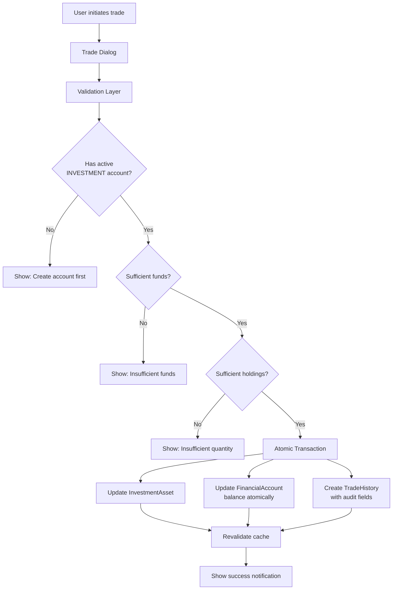

# Investment Transaction Validation Layer Implementation Plan

## Overview
Implement a comprehensive validation layer for investment transactions that enforces INVESTMENT account prerequisites, handles atomic balance adjustments, and maintains a complete audit trail.

## Current State Analysis

### Existing Models
- `FinancialAccount` - Has `AccountType` enum including `INVESTMENT`
- `InvestmentAsset` - Holds investment data but no account linkage
- `TradeHistory` - Records trades but no account linkage
- No validation for active INVESTMENT account prerequisite
- No balance deduction/credit on trade execution

### Key Files
- `src/actions/investment-actions.ts` - Server actions for investments
- `src/components/investments/AddInvestmentDialog.tsx` - Buy/create investment UI
- `src/components/investments/RecordSellTradeDialog.tsx` - Sell trade UI
- `prisma/schema.prisma` - Database schema

---

## Implementation Details

### 1. Database Schema Migration

**Changes Required:**
```prisma
// Add account relation to InvestmentAsset
model InvestmentAsset {
  // ... existing fields
  accountId String?
  account   FinancialAccount? @relation(fields: [accountId], references: [id], onDelete: SetNull)
  
  @@index([accountId])
}

// Add account relation to TradeHistory for audit trail
model TradeHistory {
  // ... existing fields
  accountId String?
  account   FinancialAccount? @relation(fields: [accountId], references: [id], onDelete: SetNull)
  
  // Track balance adjustment for audit
  balanceBefore Float?
  balanceAfter  Float?
  
  @@index([accountId])
}
```

**Migration Command:**
```bash
npx prisma migrate dev --name add_investment_account_linkage
```

---

### 2. Validation Utilities (`src/lib/investment-validation.ts`)

```typescript
/**
 * Validates that user has at least one active INVESTMENT-type account
 */
export async function validateInvestmentAccountPrerequisite(userId: string): Promise<{
  valid: boolean;
  accounts: FinancialAccount[];
  error?: string;
}>

/**
 * Validates sufficient funds for buy order
 */
export async function validateSufficientFunds(
  accountId: string, 
  requiredAmount: number
): Promise<{
  valid: boolean;
  currentBalance: number;
  error?: string;
}>

/**
 * Validates that user has sufficient quantity to sell
 */
export async function validateHoldingExists(
  userId: string,
  assetId: string,
  sellQuantity: number
): Promise<{
  valid: boolean;
  currentQuantity: number;
  error?: string;
}>
```

---

### 3. Enhanced Action Interfaces

**Updated Schemas in `investment-actions.ts`:**
```typescript
const investmentAssetSchema = z.object({
  symbol: z.string().min(1),
  name: z.string().optional(),
  quantity: z.number().positive(),
  avgBuyPrice: z.number().positive(),
  currency: z.string().default("IDR"),
  accountId: z.string().min(1, "Investment account is required"), // NEW
});

const tradeSchema = z.object({
  assetId: z.string().min(1),
  type: z.enum(["BUY", "SELL"]),
  quantity: z.number().positive(),
  pricePerUnit: z.number().positive(),
  fees: z.number().min(0).default(0),
  date: z.date().default(() => new Date()),
  notes: z.string().optional(),
  accountId: z.string().min(1, "Investment account is required"), // NEW
});
```

---

### 4. Refactored `createInvestmentAsset` Action

**Key Changes:**
1. Validate INVESTMENT account prerequisite
2. Validate account belongs to user and is active
3. Validate sufficient funds (total cost = quantity * avgBuyPrice)
4. Execute atomic transaction:
   - Create/update InvestmentAsset
   - Create TradeHistory record
   - Deduct balance from FinancialAccount
   - Record balanceBefore and balanceAfter in TradeHistory
5. Revalidate paths

**Pseudo-flow:**
```
1. Auth check
2. Validate input schema (including accountId)
3. Fetch and validate INVESTMENT account
4. Check sufficient funds: account.balance >= totalCost
5. Execute Prisma transaction:
   a. Lock account row (select for update)
   b. Create/update InvestmentAsset
   c. Create TradeHistory with balanceBefore/After
   d. Update account balance (decrement)
6. Return success with audit data
```

---

### 5. Refactored `recordTrade` Action

**Key Changes:**
1. Validate INVESTMENT account prerequisite
2. For BUY trades:
   - Validate sufficient funds
   - Deduct balance atomically
   - Update InvestmentAsset quantity and avgBuyPrice
3. For SELL trades:
   - Validate holding exists and has sufficient quantity
   - Credit proceeds to account (minus fees)
   - Calculate realized PnL
   - Update/delete InvestmentAsset
4. Record audit trail with balanceBefore/After

**Pseudo-flow:**
```
1. Auth check
2. Validate input schema (including accountId)
3. Fetch and validate INVESTMENT account
4. Fetch asset within transaction
5. If BUY:
   a. Validate sufficient funds
   b. Update asset (weighted avg price)
   c. Deduct balance, record audit
6. If SELL:
   a. Validate sufficient quantity
   b. Calculate realized PnL
   c. Update/delete asset
   d. Credit balance, record audit
7. Create TradeHistory record
```

---

### 6. New Action: `getInvestmentAccounts`

```typescript
export async function getInvestmentAccounts(): Promise<{
  success: boolean;
  data?: FinancialAccount[];
  error?: string;
}>
```
- Returns only active INVESTMENT-type accounts for the current user
- Used to populate account selector dropdowns

---

### 7. UI Updates

#### AddInvestmentDialog Changes:
- Add account selector dropdown (required field)
- Filter accounts by type = INVESTMENT and isActive = true
- Display account balance next to each option
- Show error if no INVESTMENT accounts exist
- Show error if selected account has insufficient funds

#### RecordSellTradeDialog Changes:
- Add account selector dropdown for crediting proceeds
- Same filtering logic as buy dialog
- Display projected balance after credit

#### New Component: InvestmentAccountSelector
```typescript
interface InvestmentAccountSelectorProps {
  value: string;
  onChange: (accountId: string) => void;
  disabled?: boolean;
  showBalance?: boolean;
}
```

---

### 8. Audit Trail Component

**TradeHistoryTable Enhancements:**
- Display account name associated with each trade
- Show balance adjustment indicator (e.g., "-Rp 1,000,000 from Account X")
- Add filter by account

**New Component: TradeAuditLog**
- Detailed view of all balance adjustments
- Filterable by date range, account, trade type
- Export capability for reporting

---

## Data Flow Architecture



---

## Error Handling Strategy

| Error Scenario | User Message | Action |
|----------------|--------------|--------|
| No INVESTMENT account | "Please create an INVESTMENT account first" | Redirect to accounts page |
| Account inactive | "Selected account is inactive" | Prompt to activate |
| Insufficient funds (BUY) | "Insufficient balance in {accountName}" | Show current vs required |
| Insufficient holdings (SELL) | "You only own {X} shares" | Show current holdings |
| Race condition detected | "Transaction conflict, please retry" | Allow retry |
| Database error | "Failed to process transaction" | Log error, show generic message |

---

## Testing Checklist

- [ ] Buy with valid account and sufficient funds
- [ ] Buy with insufficient funds (should fail)
- [ ] Buy without INVESTMENT account (should fail)
- [ ] Sell with valid account and sufficient holdings
- [ ] Sell with insufficient holdings (should fail)
- [ ] Concurrent buy transactions (test atomicity)
- [ ] Audit trail records correct balanceBefore/After
- [ ] Account balance updates correctly for both buy and sell
- [ ] Realized PnL calculated correctly on sells

---

## Migration Rollback Plan

If issues occur after deployment:
1. Revert Prisma migration: `npx prisma migrate resolve --rolled-back add_investment_account_linkage`
2. Restore previous code version
3. Account balance corrections (if needed) can be done via admin script
