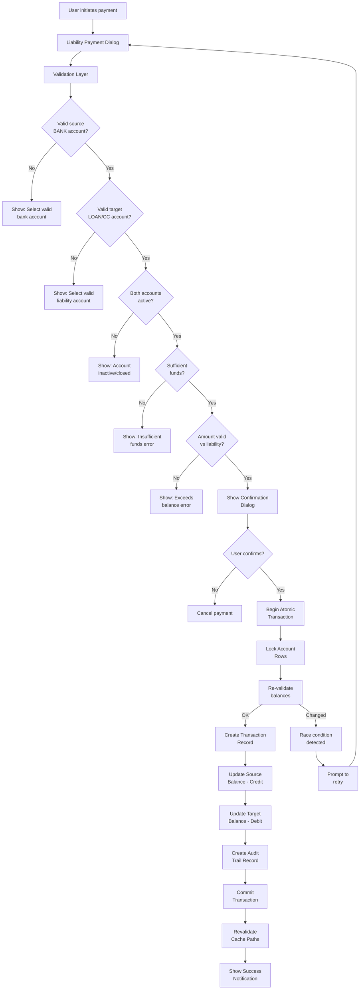

# Liability Payment Transaction Module Implementation Plan

## Overview
Implement a comprehensive liability payment transaction module that enables users to execute debt payoff operations with double-entry bookkeeping principles, atomic transactions, and complete audit trails.

## Requirements Analysis

### Core Functionality
1. **Source Account**: Bank type account with real-time balance validation
2. **Target Account**: Loan or Credit Card type liability account
3. **Double-Entry Bookkeeping**: Debit liability (reduce debt), Credit bank (reduce cash)
4. **Atomic Transactions**: Database transaction with rollback capabilities
5. **Validation Rules**: Sufficient funds, active accounts, payment amount constraints

### Business Rules
- Payment amount cannot exceed liability balance (unless overpayment protection disabled)
- Both accounts must be active (not frozen or closed)
- Source account must have sufficient available funds
- Mandatory fields: date, amount, description, reference number
- Automatic balance recalculation on commit
- Immutable audit trail with user attribution and timestamp

---

## Implementation Architecture

### 1. Database Schema Extensions

**File**: [`prisma/schema.prisma`](prisma/schema.prisma)

Add new fields to [`Transaction`](prisma/schema.prisma:145) model for liability payments:

```prisma
model Transaction {
  id           String          @id @default(cuid())
  amount       Float
  currency     String          @default("IDR")
  exchangeRate Float           @default(1)
  type         TransactionType
  description  String?
  date         DateTime        @default(now())
  isRecurring  Boolean         @default(false)
  
  // Liability payment specific fields
  referenceNumber String?      @unique  // Unique payment reference
  isOverpayment   Boolean      @default(false)  // Flag for overpayment scenarios
  paymentStatus   PaymentStatus @default(COMPLETED)
  
  // Audit trail fields
  createdBy       String       // User ID who created the payment
  processedAt     DateTime     @default(now())
  
  // Relations
  userId String
  user   User   @relation(fields: [userId], references: [id], onDelete: Cascade)

  accountId String
  account   FinancialAccount @relation("FromAccount", fields: [accountId], references: [id], onDelete: Cascade)

  toAccountId String?
  toAccount   FinancialAccount? @relation("ToAccount", fields: [toAccountId], references: [id], onDelete: Cascade)

  categoryId String?
  category   Category? @relation(fields: [categoryId], references: [id], onDelete: SetNull)

  recurringRuleId String?
  recurringRule   RecurringRule? @relation(fields: [recurringRuleId], references: [id], onDelete: SetNull)

  createdAt          DateTime          @default(now())
  updatedAt          DateTime          @updatedAt
  financialAccount   FinancialAccount? @relation(fields: [financialAccountId], references: [id])
  financialAccountId String?

  @@index([userId])
  @@index([accountId])
  @@index([toAccountId])
  @@index([categoryId])
  @@index([date])
  @@index([referenceNumber])
}

enum PaymentStatus {
  PENDING
  PROCESSING
  COMPLETED
  FAILED
  ROLLED_BACK
}
```

**New Model: LiabilityPaymentAudit**

```prisma
model LiabilityPaymentAudit {
  id              String   @id @default(cuid())
  transactionId   String   @unique
  transaction     Transaction @relation(fields: [transactionId], references: [id], onDelete: Cascade)
  
  // Source account snapshot
  sourceAccountId     String
  sourceBalanceBefore Float
  sourceBalanceAfter  Float
  
  // Target account snapshot
  targetAccountId     String
  targetBalanceBefore Float
  targetBalanceAfter  Float
  
  // Payment details
  paymentAmount       Float
  currency            String
  exchangeRate        Float
  
  // Audit metadata
  executedBy          String
  executedAt          DateTime @default(now())
  ipAddress           String?  // For compliance
  userAgent           String?  // For compliance
  
  // Rollback information
  isRolledBack        Boolean  @default(false)
  rolledBackAt        DateTime?
  rollbackReason      String?
  
  @@index([transactionId])
  @@index([executedBy])
  @@index([executedAt])
}
```

**Migration Command:**
```bash
npx prisma migrate dev --name add_liability_payment_audit
```

---

### 2. Validation Utilities

**File**: [`src/lib/liability-payment-validation.ts`](src/lib/liability-payment-validation.ts)

```typescript
/**
 * Liability Payment Validation Library
 * 
 * Provides comprehensive validation for liability payment transactions:
 * - Source account validation (BANK type, active, sufficient funds)
 * - Target account validation (LOAN or CREDIT_CARD type, active)
 * - Payment amount validation (not exceeding balance unless allowed)
 * - Reference number uniqueness
 */

import prisma from "@/lib/db";
import { FinancialAccount, Prisma } from "@prisma/client";

export interface ValidationResult<T = unknown> {
  valid: boolean;
  data?: T;
  error?: string;
  errorCode?: string;
}

export interface AccountValidationData {
  account: FinancialAccount;
  currentBalance: number;
  availableBalance: number;
}

/**
 * Validates that a source account is a BANK type, belongs to user, and is active
 */
export async function validateSourceAccount(
  userId: string,
  accountId: string
): Promise<ValidationResult<AccountValidationData>>

/**
 * Validates that a target account is a LOAN or CREDIT_CARD type, belongs to user, and is active
 */
export async function validateTargetLiabilityAccount(
  userId: string,
  accountId: string
): Promise<ValidationResult<AccountValidationData>>

/**
 * Validates that source account has sufficient funds for the payment
 */
export async function validateSufficientFunds(
  accountId: string,
  requiredAmount: number
): Promise<ValidationResult<{ currentBalance: number; currency: string }>>

/**
 * Validates that payment amount does not exceed liability balance
 * unless overpayment protection is disabled
 */
export async function validatePaymentAmount(
  liabilityAccountId: string,
  paymentAmount: number,
  allowOverpayment: boolean = false
): Promise<ValidationResult<{ liabilityBalance: number; maxPayment: number }>>

/**
 * Validates reference number uniqueness
 */
export async function validateReferenceNumber(
  referenceNumber: string
): Promise<ValidationResult<void>>

/**
 * Validates that neither account is frozen or closed
 */
export async function validateAccountStatus(
  sourceAccountId: string,
  targetAccountId: string
): Promise<ValidationResult<{ sourceActive: boolean; targetActive: boolean }>>

/**
 * Comprehensive validation for liability payment
 */
export async function validateLiabilityPayment(
  userId: string,
  data: {
    sourceAccountId: string;
    targetAccountId: string;
    amount: number;
    referenceNumber: string;
    allowOverpayment?: boolean;
  }
): Promise<ValidationResult<{
  sourceAccount: FinancialAccount;
  targetAccount: FinancialAccount;
  sourceBalanceBefore: number;
  targetBalanceBefore: number;
}>>
```

**Implementation Details:**

1. **Source Account Validation**:
   - Must be BANK type
   - Must belong to user
   - Must be active (isActive = true)
   - Return account details with current balance

2. **Target Account Validation**:
   - Must be LOAN or CREDIT_CARD type
   - Must belong to user  
   - Must be active
   - Return account details with outstanding balance

3. **Sufficient Funds Check**:
   - Compare available balance >= payment amount
   - Return formatted error with available vs required amounts

4. **Payment Amount Validation**:
   - For LOAN/CREDIT_CARD: balance is typically negative (debt)
   - Payment amount cannot exceed |balance| unless allowOverpayment = true
   - Return max payment amount allowed

5. **Reference Number Validation**:
   - Check uniqueness across all transactions
   - Return error if duplicate exists

6. **Account Status Validation**:
   - Verify both accounts are active
   - Return specific error if either is frozen/closed

---

### 3. Server Actions

**File**: [`src/actions/liability-payment-actions.ts`](src/actions/liability-payment-actions.ts)

```typescript
"use server";

import { auth } from "@/auth";
import prisma from "@/lib/db";
import { Prisma, PaymentStatus } from "@prisma/client";
import { revalidatePath } from "next/cache";
import { z } from "zod";
import {
  validateLiabilityPayment,
  validateReferenceNumber,
} from "@/lib/liability-payment-validation";

// Schema for liability payment input
const liabilityPaymentSchema = z.object({
  sourceAccountId: z.string().min(1, "Source account is required"),
  targetAccountId: z.string().min(1, "Target liability account is required"),
  amount: z.number().positive("Payment amount must be positive"),
  currency: z.string().default("IDR"),
  exchangeRate: z.number().positive().default(1),
  description: z.string().min(1, "Description is required"),
  date: z.date().default(() => new Date()),
  referenceNumber: z.string().min(1, "Reference number is required"),
  allowOverpayment: z.boolean().default(false),
});

export type LiabilityPaymentInput = z.infer<typeof liabilityPaymentSchema>;

export interface PaymentResult {
  success: boolean;
  data?: {
    transactionId: string;
    referenceNumber: string;
    sourceAccountId: string;
    targetAccountId: string;
    amount: number;
    sourceBalanceAfter: number;
    targetBalanceAfter: number;
  };
  error?: string;
  errorCode?: string;
}

/**
 * Creates a liability payment transaction with double-entry bookkeeping
 * 
 * Business Logic:
 * 1. Validate all inputs and business rules
 * 2. Lock both accounts for update (prevent race conditions)
 * 3. Create transaction record with PENDING status
 * 4. Update source account balance (decrement)
 * 5. Update target account balance (increment toward zero)
 * 6. Create audit trail record
 * 7. Update transaction status to COMPLETED
 * 8. Revalidate affected paths
 */
export async function createLiabilityPayment(
  data: LiabilityPaymentInput
): Promise<PaymentResult>

/**
 * Retrieves liability payment details with audit trail
 */
export async function getLiabilityPaymentDetails(transactionId: string)

/**
 * Rolls back a liability payment (for admin/error scenarios)
 */
export async function rollbackLiabilityPayment(
  transactionId: string,
  reason: string
)

/**
 * Gets payment history for a specific liability account
 */
export async function getLiabilityPaymentHistory(accountId: string, options?: {
  limit?: number;
  offset?: number;
  startDate?: Date;
  endDate?: Date;
})

/**
 * Generates a unique reference number
 */
export async function generatePaymentReference(): Promise<string>
```

**Transaction Flow (Atomic Operation):**

```
1. Auth check - verify user session
2. Schema validation - validate input format
3. Business validation - call validateLiabilityPayment()
4. Check reference number uniqueness
5. BEGIN PRISMA TRANSACTION
   a. Lock source account (FOR UPDATE)
   b. Lock target account (FOR UPDATE)
   c. Re-validate balances (race condition check)
   d. Create Transaction record with:
      - type: EXPENSE (liability payment)
      - status: PENDING
      - referenceNumber
   e. Update source account balance -= amount
   f. Update target account balance += amount (reduces debt)
   g. Create LiabilityPaymentAudit record with:
      - Before/after balances for both accounts
      - User attribution
      - Timestamp
   h. Update Transaction status to COMPLETED
6. COMMIT / ROLLBACK on error
7. Revalidate paths
8. Return success with transaction details
```

**Double-Entry Bookkeeping Logic:**

For a liability payment:
- **Debit (Increase)**: Liability account (reducing the negative balance)
- **Credit (Decrease)**: Bank account (reducing available cash)

Example:
- Credit Card Balance: -Rp 5,000,000
- Payment Amount: Rp 2,000,000
- After Payment:
  - Credit Card: -Rp 3,000,000 (debited/increased toward zero)
  - Bank Account: Rp 8,000,000 -> Rp 6,000,000 (credited/decreased)

---

### 4. UI Components

#### 4.1 Liability Payment Dialog

**File**: [`src/components/liability/LiabilityPaymentDialog.tsx`](src/components/liability/LiabilityPaymentDialog.tsx)

```typescript
interface LiabilityPaymentDialogProps {
  onSuccess?: () => void;
  preselectedLiabilityId?: string;  // Optional pre-selection
}

export function LiabilityPaymentDialog({ 
  onSuccess, 
  preselectedLiabilityId 
}: LiabilityPaymentDialogProps)
```

**Features:**
- Source account selector (filtered to BANK type only)
- Target account selector (filtered to LOAN/CREDIT_CARD type)
- Real-time balance display for both accounts
- Amount input with currency formatting
- Reference number auto-generation with manual override
- Description field
- Date picker (defaults to today)
- Overpayment protection toggle (admin only)
- Validation error display
- Confirmation summary before submit

#### 4.2 Account Balance Display

**File**: [`src/components/liability/AccountBalanceCard.tsx`](src/components/liability/AccountBalanceCard.tsx)

```typescript
interface AccountBalanceCardProps {
  accountId: string;
  showAvailableBalance?: boolean;
  highlightInsufficient?: boolean;
  requiredAmount?: number;
}
```

**Features:**
- Display current balance with currency formatting
- Show available vs actual balance distinction
- Visual indicator for insufficient funds
- Real-time updates on account selection

#### 4.3 Payment History Table

**File**: [`src/components/liability/LiabilityPaymentHistory.tsx`](src/components/liability/LiabilityPaymentHistory.tsx)

```typescript
interface LiabilityPaymentHistoryProps {
  accountId?: string;  // Filter by specific account, or show all
  limit?: number;
  showPagination?: boolean;
}
```

**Features:**
- List all liability payments
- Filter by account
- Sort by date (newest first)
- Show payment details: amount, date, reference, description
- Status indicators (completed, failed, rolled back)
- Export to CSV capability

#### 4.4 Payment Confirmation

**File**: [`src/components/liability/PaymentConfirmationDialog.tsx`](src/components/liability/PaymentConfirmationDialog.tsx)

```typescript
interface PaymentConfirmationDialogProps {
  isOpen: boolean;
  onClose: () => void;
  paymentData: {
    sourceAccount: FinancialAccount;
    targetAccount: FinancialAccount;
    amount: number;
    referenceNumber: string;
    description: string;
  };
  onConfirm: () => void;
}
```

**Features:**
- Summary of payment details
- Before/after balance preview
- Risk warnings (if applicable)
- Confirm/Cancel buttons

---

### 5. Error Handling & Audit Trail

#### Error Codes & Messages

| Error Code | Scenario | User Message | Action |
|------------|----------|--------------|--------|
| `AUTH_REQUIRED` | User not authenticated | "Please log in to continue" | Redirect to login |
| `INVALID_SOURCE_ACCOUNT` | Source not BANK type | "Please select a bank account" | Show account selector |
| `INVALID_TARGET_ACCOUNT` | Target not LOAN/CC | "Please select a loan or credit card account" | Show liability selector |
| `INSUFFICIENT_FUNDS` | Balance < payment amount | "Insufficient funds. Available: X, Required: Y" | Show balance, suggest partial payment |
| `ACCOUNT_INACTIVE` | Source or target inactive | "Account is inactive or closed" | Show activation option |
| `PAYMENT_EXCEEDS_BALANCE` | Amount > liability | "Payment exceeds outstanding balance" | Show max payment amount |
| `DUPLICATE_REFERENCE` | Reference number exists | "Reference number already used" | Generate new reference |
| `TRANSACTION_FAILED` | Database error | "Payment could not be processed" | Allow retry, log error |
| `ROLLBACK_FAILED` | Rollback error | "Cannot reverse this payment" | Contact support message |

#### Audit Trail Requirements

Every liability payment creates an immutable audit record with:

1. **Transaction Details**:
   - Transaction ID
   - Reference number
   - Payment amount and currency
   - Exchange rate (if multi-currency)

2. **Account Snapshots**:
   - Source account ID, balance before/after
   - Target account ID, balance before/after

3. **Execution Metadata**:
   - User ID who executed the payment
   - Timestamp (executedAt)
   - IP address (for compliance)
   - User agent (for compliance)

4. **Rollback Information** (if applicable):
   - Is rolled back flag
   - Rollback timestamp
   - Rollback reason

#### Data Integrity Safeguards

1. **Atomic Transactions**: All operations wrapped in Prisma $transaction
2. **Row Locking**: SELECT FOR UPDATE on both accounts during processing
3. **Idempotency**: Reference number uniqueness prevents duplicate payments
4. **Status Tracking**: Payment status field tracks lifecycle (PENDING -> COMPLETED/FAILED)
5. **Balance Reconciliation**: Audit records enable manual balance verification

---

## Data Flow Architecture



---

## Integration Points

### 1. Transaction Actions Integration

Update [`src/actions/transaction-actions.ts`](src/actions/transaction-actions.ts) to:
- Handle LIABILITY_PAYMENT type in createTransaction
- Add special handling for double-entry bookkeeping
- Integrate with liability payment validation

### 2. Account Summary Updates

Update [`src/actions/account-actions.ts`](src/actions/account-actions.ts) [`getAccountsSummary`](src/actions/account-actions.ts:156):
- Recalculate liability totals after payment
- Update net worth calculation

### 3. Dashboard Integration

Update dashboard to show:
- Recent liability payments
- Outstanding liabilities summary
- Payment due reminders

### 4. Recurring Payments Integration

Extend [`src/actions/recurring-actions.ts`](src/actions/recurring-actions.ts):
- Support recurring liability payments
- Validate accounts still valid on each execution

---

## Testing Checklist

### Unit Tests
- [ ] Source account validation (BANK type, active, ownership)
- [ ] Target account validation (LOAN/CC type, active, ownership)
- [ ] Sufficient funds validation
- [ ] Payment amount vs liability balance validation
- [ ] Reference number uniqueness validation
- [ ] Account status validation (frozen/closed)

### Integration Tests
- [ ] Complete payment flow with valid accounts
- [ ] Payment with insufficient funds (should fail gracefully)
- [ ] Payment exceeding liability balance with overpayment disabled
- [ ] Payment with inactive source account
- [ ] Payment with inactive target account
- [ ] Duplicate reference number rejection
- [ ] Concurrent payment attempts (race condition handling)
- [ ] Transaction rollback on database error
- [ ] Audit trail record creation
- [ ] Balance recalculation accuracy

### E2E Tests
- [ ] User creates liability payment through UI
- [ ] User views payment history
- [ ] User receives insufficient funds error
- [ ] Payment reflects in account balances
- [ ] Payment appears in transaction list
- [ ] Audit log shows correct before/after balances

---

## Security Considerations

1. **Authorization**: Verify user owns both accounts before processing
2. **Input Validation**: Strict schema validation on all inputs
3. **SQL Injection**: Use parameterized queries via Prisma
4. **Race Conditions**: Row locking during transaction processing
5. **Audit Trail**: Immutable records for compliance
6. **Idempotency**: Reference number prevents duplicate processing
7. **Overpayment Protection**: Configurable flag to prevent accidental overpayment

---

## Migration Rollback Plan

If issues occur after deployment:

1. **Database Rollback**:
   ```bash
   npx prisma migrate resolve --rolled-back add_liability_payment_audit
   ```

2. **Code Rollback**: Revert to previous version

3. **Data Correction Script**:
   ```typescript
   // Script to verify and correct any inconsistent balances
   // after rollback if needed
   ```

4. **Communication Plan**:
   - Notify users of any failed transactions
   - Provide manual correction process if needed

---

## Performance Considerations

1. **Database Indexing**: Ensure indexes on frequently queried fields
   - `referenceNumber` (unique lookup)
   - `userId` + `date` (payment history queries)
   - `toAccountId` (liability account queries)

2. **Transaction Isolation**: Use appropriate isolation level
   - Default Prisma isolation sufficient for most cases
   - Consider SERIALIZABLE for high-concurrency scenarios

3. **Caching Strategy**:
   - Revalidate paths after successful payment
   - Cache account balances with short TTL

4. **Batch Operations**:
   - Support bulk payment processing if needed
   - Optimize audit log queries with pagination
