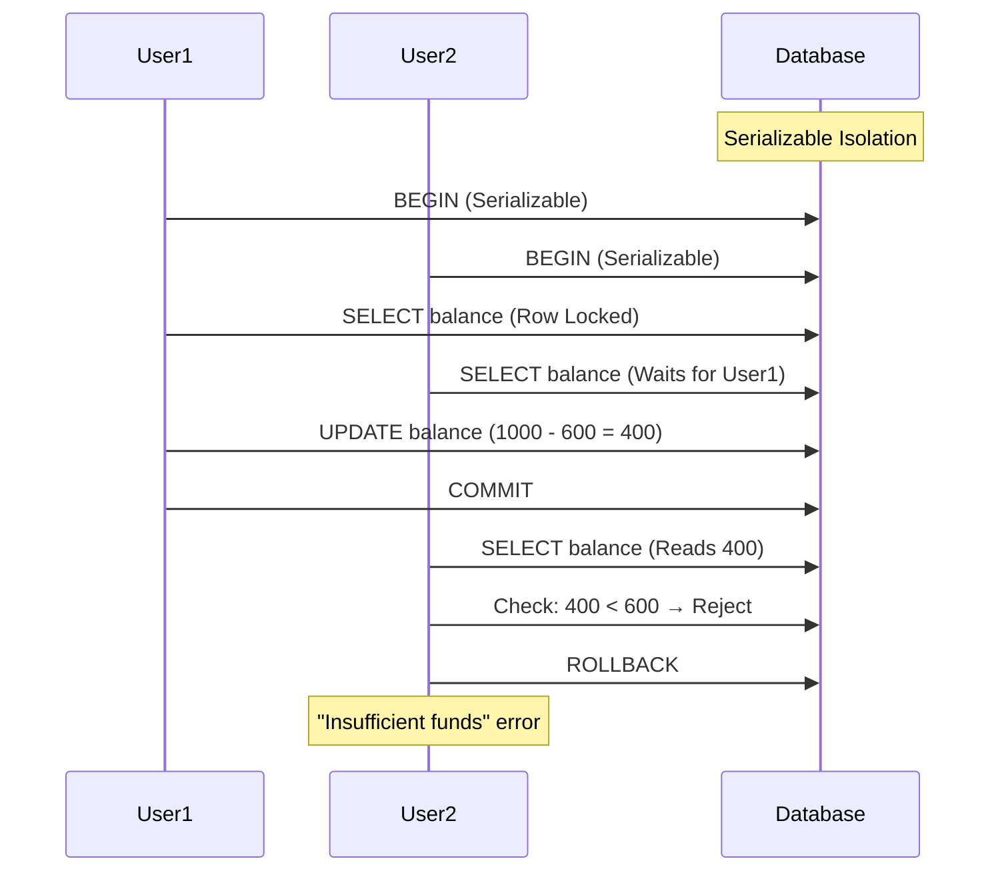
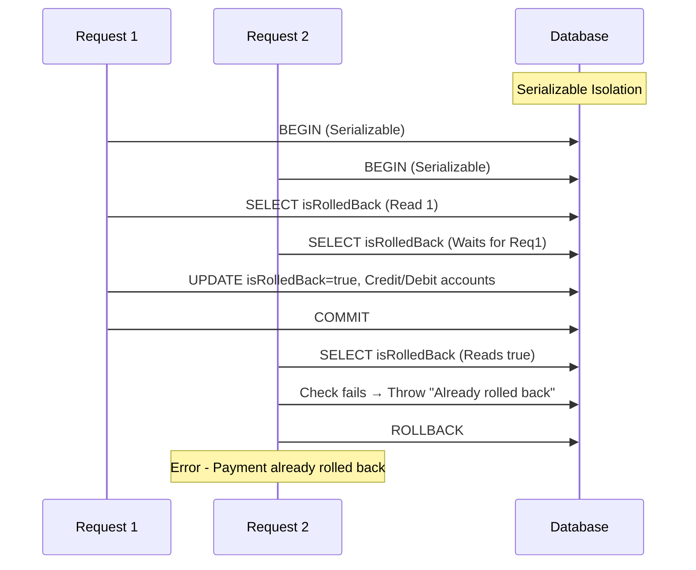

# Race Condition Fix Plan

## Summary

This plan addresses race condition vulnerabilities in:
1. **Investment Actions** - `createInvestmentAsset` and `recordTrade` functions
2. **Liability Payment Actions** - `rollbackLiabilityPayment` function

---

## Part 1: Liability Payment Rollback Vulnerability

### Issue Location

[`rollbackLiabilityPayment`](src/actions/liability-payment-actions.ts:304) function at lines 318-385 has a **race condition vulnerability**.

### The Problem

The function checks `isRolledBack` flag without using Serializable isolation or row locking:

```typescript
const result = await prisma.$transaction(async (tx: Prisma.TransactionClient) => {
  const transaction = await tx.transaction.findFirst({
    where: { id: transactionId, userId: session.user.id },
    include: { liabilityPaymentAudit: true },
  });

  // Check is passed - but this is NOT atomic!
  if (transaction.liabilityPaymentAudit.isRolledBack) {
    throw new Error("Payment has already been rolled back");
  }

  // Two concurrent requests can BOTH pass this check
  // before either updates the isRolledBack flag
  // Result: Double credit/debit of accounts!

  await tx.financialAccount.update({
    where: { id: liabilityPaymentAudit.sourceAccountId },
    data: { balance: { increment: liabilityPaymentAudit.paymentAmount } },
  });
  // ... more updates
});
// NO isolationLevel, NO maxWait, NO timeout
```

### Attack Scenario

```
Request 1: Rollback $500 payment          Request 2: Rollback $500 payment
─────────────────────────────────────   ─────────────────────────────────────
1. Read isRolledBack: false ✓             1. Read isRolledBack: false ✓
2. Passes check ✓                         2. Passes check ✓
3. Credit source: +$500                   3. Credit source: +$500
4. Debit target: -$500                    4. Debit target: -$500
5. Update isRolledBack: true              5. Update isRolledBack: true
6. Commit                                  6. Commit

Result: Accounts adjusted TWICE → $1000 total adjustment (CORRUPTION!)
```

### Existing Pattern (Already Fixed)

The [`createLiabilityPayment`](src/actions/liability-payment-actions.ts:111) function correctly uses:
- `isolationLevel: Prisma.TransactionIsolationLevel.Serializable`
- `maxWait: 5000` (5 seconds)
- `timeout: 10000` (10 seconds)

### Solution

Add the same transaction options to `rollbackLiabilityPayment`.

---

## Part 2: Investment Actions Vulnerability

## Issue Summary

The [`createInvestmentAsset`](src/actions/investment-actions.ts:55) and [`recordTrade`](src/actions/investment-actions.ts:287) functions have a **race condition vulnerability** in their financial balance checks.

### Problem Location

The code at lines 103-110, 194-202, and 330-338 uses `findUnique()` to read account balance within a transaction:

```typescript
// Lock account row for update to prevent race conditions
const lockedAccount = await tx.financialAccount.findUnique({
  where: { id: accountId },
});

if (!lockedAccount || lockedAccount.balance < totalAmount) {
  throw new Error("Insufficient funds or account not found");
}
```

**The Issue**: `findUnique()` is a **read-only** operation that does NOT lock the row. The comment says "Lock account row" but the implementation does not actually lock anything.

### Attack Scenario

```
User Account Balance: 1000

Request 1: Buy for 600          Request 2: Buy for 600
─────────────────────────────   ─────────────────────────────
1. Read balance: 1000 ✓         1. Read balance: 1000 ✓
2. Check: 1000 >= 600 ✓         2. Check: 1000 >= 600 ✓
3. Update: 1000 - 600 = 400     3. Update: 1000 - 600 = 400
                                  Result: Balance = -200 ❌
```

Both requests pass the balance check simultaneously, resulting in a negative balance.

### Existing Pattern in Codebase

The [`liabilityPayment`](src/actions/liability-payment-actions.ts:118) function correctly uses:
- `isolationLevel: Prisma.TransactionIsolationLevel.Serializable`
- `maxWait: 5000` (5 seconds)
- `timeout: 10000` (10 seconds)

This inconsistent approach leaves investment actions vulnerable.

## Solution Options

### Option 1: Serializable Isolation Level (Recommended)
Add transaction options similar to `liability-payment-actions.ts`.

**Pros:**
- Consistent with existing codebase patterns
- Works at transaction level, no schema changes
- Prisma natively supports this

**Cons:**
- Higher transaction conflict rates under high concurrency
- May require retry logic for failed transactions
- Performance overhead from stricter isolation

### Option 2: Atomic Update with Conditional WHERE
Use Prisma's atomic operations with a WHERE clause that checks balance.

```typescript
const result = await tx.financialAccount.update({
  where: {
    id: accountId,
    balance: { gte: totalAmount }  // Only update if sufficient funds
  },
  data: {
    balance: { decrement: totalAmount }
  }
});

if (!result) {
  throw new Error("Insufficient funds");
}
```

**Pros:**
- Atomic operation - no race condition possible
- No schema changes required
- Works with any isolation level
- Returns null if condition fails

**Cons:**
- Slight change in balance check logic
- Need to re-fetch account after update for balanceBefore/balanceAfter

### Option 3: Raw SQL with SELECT ... FOR UPDATE
Use `$queryRaw` for proper row-level locking.

**Pros:**
- True row-level locking at database level
- Most reliable solution

**Cons:**
- Breaks Prisma abstraction
- Database-specific SQL syntax
- More complex error handling

## Recommended Solution

**Use Option 1 (Serializable Isolation)** with slight improvements:
1. Add transaction isolation level to all three transaction blocks
2. Add retry logic for transient failures
3. Keep existing balance validation for better error messages

This maintains consistency with the existing codebase and provides strong guarantees against race conditions.

## Implementation Plan

### Step 1: Add Transaction Isolation Options

Modify all three `$transaction` calls to include isolation level:

```typescript
await prisma.$transaction(
  async (tx) => {
    // ... existing code ...
  },
  {
    isolationLevel: Prisma.TransactionIsolationLevel.Serializable,
    maxWait: 5000,    // 5 seconds max to wait for lock
    timeout: 10000,   // 10 seconds max transaction duration
  }
);
```

**Files to modify:**
- [`src/actions/investment-actions.ts`](src/actions/investment-actions.ts:102) - Line 102
- [`src/actions/investment-actions.ts`](src/actions/investment-actions.ts:194) - Line 194
- [`src/actions/investment-actions.ts`](src/actions/investment-actions.ts:330) - Line 330

### Step 2: Add Retry Logic

Create a wrapper function for transactions with automatic retry:

```typescript
async function withRetry<T>(
  fn: (tx: Prisma.TransactionClient) => Promise<T>,
  maxRetries: number = 3
): Promise<T> {
  for (let attempt = 1; attempt <= maxRetries; attempt++) {
    try {
      return await prisma.$transaction(fn, {
        isolationLevel: Prisma.TransactionIsolationLevel.Serializable,
        maxWait: 5000,
        timeout: 10000,
      });
    } catch (error) {
      if (isTransactionConflictError(error) && attempt < maxRetries) {
        await sleep(100 * attempt); // Exponential backoff
        continue;
      }
      throw error;
    }
  }
  throw new Error("Transaction failed after maximum retries");
}
```

### Step 3: Update Error Handling

Distinguish between:
- Insufficient funds errors (user-facing)
- Transaction conflict errors (retry automatically)

### Step 4: Verify Concurrent Access

Add integration tests that simulate concurrent requests to verify the fix.

## Files to Modify

1. `src/actions/investment-actions.ts`
   - Add import for `TransactionIsolationLevel`
   - Update 3 transaction calls with isolation level
   - Add retry wrapper function
   - Improve error handling

## Verification Strategy

1. **Code Review**: Verify all balance checks are within the transaction
2. **Load Testing**: Simulate concurrent requests to verify no race conditions
3. **Unit Tests**: Test balance validation logic
4. **Integration Tests**: Test full transaction flow with concurrent access

## Risk Assessment

- **Low Risk**: The fix uses established patterns from the existing codebase
- **No Schema Changes**: Only code modifications
- **Backward Compatible**: No breaking changes to API

## Timeline

- Implementation: 1-2 hours
- Testing: 1 hour
- Code Review: 30 minutes

## Diagram: Fixed Flow



---

## Part 3: Rollback Fix Implementation Plan

### File to Modify

`src/actions/liability-payment-actions.ts`

### Changes Required

1. **Add transaction options** to `rollbackLiabilityPayment` function (line 318)

   **Before:**
   ```typescript
   const result = await prisma.$transaction(async (tx: Prisma.TransactionClient) => {
     // ...
   });
   ```

   **After:**
   ```typescript
   const result = await prisma.$transaction(
     async (tx: Prisma.TransactionClient) => {
       // ...
     },
     {
       isolationLevel: Prisma.TransactionIsolationLevel.Serializable,
       maxWait: 5000,  // 5 seconds
       timeout: 10000, // 10 seconds
     }
   );
   ```

2. **Add error handling** for transaction conflicts/deadlocks

   **After the catch block** (around line 395), add handling for serialization failures:

   ```typescript
   // Handle transaction timeout/serialization errors
   if (
     error instanceof Prisma.PrismaClientUnknownRequestError &&
     error.message.includes("deadlock")
   ) {
     return {
       success: false,
       errorCode: "RACE_CONDITION",
       error:
         "Another rollback is currently processing. Please wait a moment and try again.",
     };
   }
   ```

### Diagram: Fixed Rollback Flow



### Verification Steps

1. Test concurrent rollback requests - second request should fail with appropriate error
2. Verify account balances are adjusted only once
3. Test error handling for transaction conflicts

### Risk Assessment

- **Low Risk**: Consistent with existing codebase pattern
- **No Schema Changes**: Only code modifications
- **Backward Compatible**: No API changes
