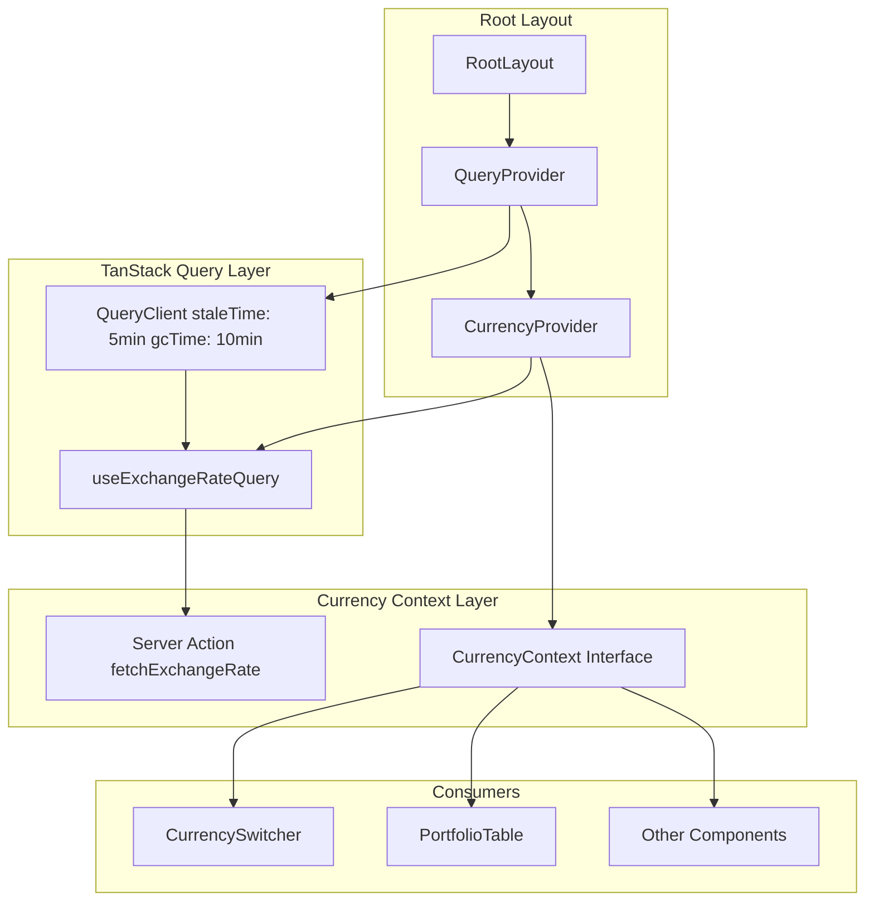

# TanStack Query Refactoring Implementation Plan

## Overview

This plan transforms the current imperative data fetching pattern in CurrencyContext into a declarative TanStack Query approach while maintaining backward compatibility with existing consuming components.

## Architecture



## Implementation Steps

### Step 1: Install Dependencies

Install TanStack Query packages:
```bash
npm install @tanstack/react-query @tanstack/react-query-devtools
```

### Step 2: Create QueryProvider Component

Create `src/components/providers/QueryProvider.tsx`:

```tsx
'use client'

import { isServer, QueryClient, QueryClientProvider } from '@tanstack/react-query'
import { ReactQueryDevtools } from '@tanstack/react-query-devtools'
import { ReactNode } from 'react'

function makeQueryClient() {
  return new QueryClient({
    defaultOptions: {
      queries: {
        // Financial data: 5 minutes stale time to prevent excessive API calls
        staleTime: 5 * 60 * 1000,
        // Keep data in cache for 10 minutes after becoming inactive
        gcTime: 10 * 60 * 1000,
        // Retry failed requests 3 times
        retry: 3,
        // Refetch on window focus for live data
        refetchOnWindowFocus: true,
        // Refetch on reconnect
        refetchOnReconnect: true,
      },
      mutations: {
        retry: 1,
      },
    },
  })
}

let browserQueryClient: QueryClient | undefined = undefined

function getQueryClient() {
  if (isServer) {
    return makeQueryClient()
  } else {
    if (!browserQueryClient) browserQueryClient = makeQueryClient()
    return browserQueryClient
  }
}

interface QueryProviderProps {
  children: ReactNode
}

export function QueryProvider({ children }: QueryProviderProps) {
  const queryClient = getQueryClient()

  return (
    <QueryClientProvider client={queryClient}>
      {children}
      <ReactQueryDevtools initialIsOpen={false} />
    </QueryClientProvider>
  )
}
```

### Step 3: Update Root Layout

Update `src/app/layout.tsx` to wrap children with QueryProvider:

```tsx
import type { Metadata } from 'next'
import { Geist, Geist_Mono } from 'next/font/google'
import './globals.css'
import { QueryProvider } from '@/components/providers/QueryProvider'

const geistSans = Geist({
  variable: '--font-geist-sans',
  subsets: ['latin'],
})

const geistMono = Geist_Mono({
  variable: '--font-geist-mono',
  subsets: ['latin'],
})

export const metadata: Metadata = {
  title: 'FinHealth - Your Financial Health Companion',
  description: 'FinHealth is your financial health companion. It helps you track your expenses, income, and investments.',
}

export default function RootLayout({
  children,
}: Readonly<{
  children: React.ReactNode
}>) {
  return (
    <html lang="en">
      <body
        className={`${geistSans.variable} ${geistMono.variable} antialiased`}
      >
        <QueryProvider>
          {children}
        </QueryProvider>
      </body>
    </html>
  )
}
```

### Step 4: Create useExchangeRateQuery Hook

Create `src/hooks/useExchangeRateQuery.ts`:

```tsx
import { fetchExchangeRate as fetchExchangeRateAction } from '@/actions/exchange-rate-actions'
import { useQuery } from '@tanstack/react-query'

interface UseExchangeRateQueryOptions {
  mainCurrency: string
  displayCurrency: string
  enabled?: boolean
}

// Query key factory for exchange rates
export const exchangeRateKeys = {
  all: ['exchange-rate'] as const,
  pair: (from: string, to: string) => 
    [...exchangeRateKeys.all, from, to] as const,
}

export function useExchangeRateQuery({
  mainCurrency,
  displayCurrency,
  enabled = true,
}: UseExchangeRateQueryOptions) {
  const isSameCurrency = mainCurrency === displayCurrency

  return useQuery({
    queryKey: exchangeRateKeys.pair(mainCurrency, displayCurrency),
    queryFn: async () => {
      // Return 1 for same currency
      if (isSameCurrency) {
        return 1
      }

      const rate = await fetchExchangeRateAction(mainCurrency, displayCurrency)
      return rate ?? 1
    },
    // Skip fetching if currencies are the same
    enabled: enabled && !isSameCurrency,
    // Return 1 immediately for same currency
    initialData: isSameCurrency ? 1 : undefined,
    // Refetch every 5 minutes for live exchange rates
    refetchInterval: 5 * 60 * 1000,
    // Consider data fresh for 5 minutes
    staleTime: 5 * 60 * 1000,
  })
}
```

### Step 5: Refactor CurrencyContext

Update `src/contexts/CurrencyContext.tsx`:

```tsx
'use client'

import { useExchangeRateQuery } from '@/hooks/useExchangeRateQuery'
import {
  createContext,
  ReactNode,
  useContext,
  useState,
} from 'react'

interface CurrencyContextType {
  displayCurrency: string
  setDisplayCurrency: (currency: string) => void
  mainCurrency: string
  exchangeRate: number
  isLoading: boolean
  isError: boolean
  error: Error | null
  convertAmount: (amount: number, fromCurrency?: string) => number
  formatInDisplayCurrency: (amount: number, fromCurrency?: string) => string
}

const CurrencyContext = createContext<CurrencyContextType | undefined>(
  undefined
)

interface CurrencyProviderProps {
  children: ReactNode
  mainCurrency: string
  initialDisplayCurrency?: string
}

export function CurrencyProvider({
  children,
  mainCurrency,
  initialDisplayCurrency,
}: CurrencyProviderProps) {
  const [displayCurrency, setDisplayCurrency] = useState(
    initialDisplayCurrency || mainCurrency
  )

  // Use TanStack Query for exchange rate fetching
  const {
    data: exchangeRate = 1,
    isLoading,
    isError,
    error,
  } = useExchangeRateQuery({
    mainCurrency,
    displayCurrency,
  })

  const convertAmount = (amount: number, fromCurrency?: string): number => {
    return amount * exchangeRate
  }

  const formatInDisplayCurrency = (
    amount: number,
    fromCurrency?: string
  ): string => {
    const convertedAmount = convertAmount(amount, fromCurrency)
    return new Intl.NumberFormat('en-US', {
      style: 'currency',
      currency: displayCurrency,
      minimumFractionDigits: 2,
      maximumFractionDigits: 2,
    }).format(convertedAmount)
  }

  return (
    <CurrencyContext.Provider
      value={{
        displayCurrency,
        setDisplayCurrency,
        mainCurrency,
        exchangeRate,
        isLoading,
        isError,
        error,
        convertAmount,
        formatInDisplayCurrency,
      }}
    >
      {children}
    </CurrencyContext.Provider>
  )
}

export function useCurrency() {
  const context = useContext(CurrencyContext)
  if (context === undefined) {
    throw new Error('useCurrency must be used within a CurrencyProvider')
  }
  return context
}
```

### Step 6: Update CurrencySwitcher

Update `src/components/CurrencySwitcher.tsx` to handle isError state:

```tsx
'use client'

import {
  Select,
  SelectContent,
  SelectItem,
  SelectTrigger,
  SelectValue,
} from '@/components/ui/select'
import { useCurrency } from '@/contexts/CurrencyContext'
import { AlertCircle, Loader2 } from 'lucide-react'
import { useSyncExternalStore } from 'react'

const SUPPORTED_CURRENCIES = [
  { code: 'USD', name: 'US Dollar', symbol: '$' },
  { code: 'EUR', name: 'Euro', symbol: '€' },
  { code: 'GBP', name: 'British Pound', symbol: '£' },
  { code: 'JPY', name: 'Japanese Yen', symbol: '¥' },
  { code: 'IDR', name: 'Indonesian Rupiah', symbol: 'Rp' },
  { code: 'SGD', name: 'Singapore Dollar', symbol: 'S$' },
  { code: 'AUD', name: 'Australian Dollar', symbol: 'A$' },
  { code: 'CAD', name: 'Canadian Dollar', symbol: 'C$' },
  { code: 'CHF', name: 'Swiss Franc', symbol: 'Fr' },
  { code: 'CNY', name: 'Chinese Yuan', symbol: '¥' },
  { code: 'INR', name: 'Indian Rupee', symbol: '₹' },
  { code: 'KRW', name: 'South Korean Won', symbol: '₩' },
  { code: 'MYR', name: 'Malaysian Ringgit', symbol: 'RM' },
  { code: 'THB', name: 'Thai Baht', symbol: '฿' },
  { code: 'VND', name: 'Vietnamese Dong', symbol: '₫' },
]

// Helper to prevent hydration mismatch in Radix UI components
function useMounted() {
  return useSyncExternalStore(
    () => () => {},
    () => true,
    () => false
  )
}

interface CurrencySwitcherProps {
  className?: string
}

export function CurrencySwitcher({ className }: CurrencySwitcherProps) {
  const { displayCurrency, setDisplayCurrency, mainCurrency, isLoading, isError } =
    useCurrency()
  const mounted = useMounted()

  // Prevent hydration mismatch by not rendering Select until mounted
  if (!mounted) {
    return (
      <div className={className}>
        <div className="border-input data-placeholder:text-muted-foreground flex w-[140px] items-center justify-between gap-2 rounded-md border bg-transparent px-3 py-2 text-sm whitespace-nowrap shadow-xs h-9">
          <Loader2 className="h-4 w-4 animate-spin" />
        </div>
      </div>
    )
  }

  return (
    <div className={className}>
      <Select value={displayCurrency} onValueChange={setDisplayCurrency}>
        <SelectTrigger className="w-[140px]">
          {isLoading ? (
            <Loader2 className="h-4 w-4 animate-spin" />
          ) : isError ? (
            <span className="flex items-center gap-1 text-destructive">
              <AlertCircle className="h-4 w-4" />
              <span className="text-xs">Error</span>
            </span>
          ) : (
            <SelectValue placeholder="Currency" />
          )}
        </SelectTrigger>
        <SelectContent>
          {SUPPORTED_CURRENCIES.map((currency) => (
            <SelectItem key={currency.code} value={currency.code}>
              <span className="flex items-center gap-2">
                <span className="font-mono">{currency.code}</span>
                {currency.code === mainCurrency && (
                  <span className="text-xs text-muted-foreground">(Main)</span>
                )}
              </span>
            </SelectItem>
          ))}
        </SelectContent>
      </Select>
    </div>
  )
}

export { SUPPORTED_CURRENCIES }
```

## QueryClient Configuration Summary

| Option | Value | Rationale |
|--------|-------|-----------|
| staleTime | 5 minutes | Exchange rates don't change rapidly; prevents unnecessary refetches |
| gcTime | 10 minutes | Keeps data in cache longer for quick navigation back |
| refetchOnWindowFocus | true | Refresh data when user returns to the app |
| refetchOnReconnect | true | Refresh when network connection is restored |
| retry | 3 | Retry failed requests for transient errors |
| refetchInterval | 5 minutes | Background polling for live exchange rates |

## Query Key Strategy

```typescript
// Query key structure for proper invalidation
['exchange-rate', mainCurrency, displayCurrency]
```

This ensures automatic refetching when either currency parameter changes.

## Benefits

1. **Automatic Caching**: Exchange rates cached across component renders
2. **Background Refetching**: Data stays fresh with automatic updates
3. **Error Handling**: Built-in retry logic and error states
4. **Deduplication**: Multiple components using the same currency pair share one request
5. **Type Safety**: Full TypeScript inference for query data and errors
6. **DevTools**: React Query Devtools for debugging cache and queries

## Backward Compatibility

The CurrencyContext interface maintains all existing properties while adding:
- `isError: boolean` - True when query fails
- `error: Error \| null` - Error object if query failed

All existing consuming components will continue to work without modifications.
